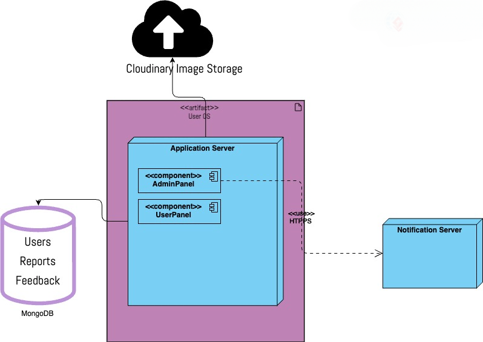
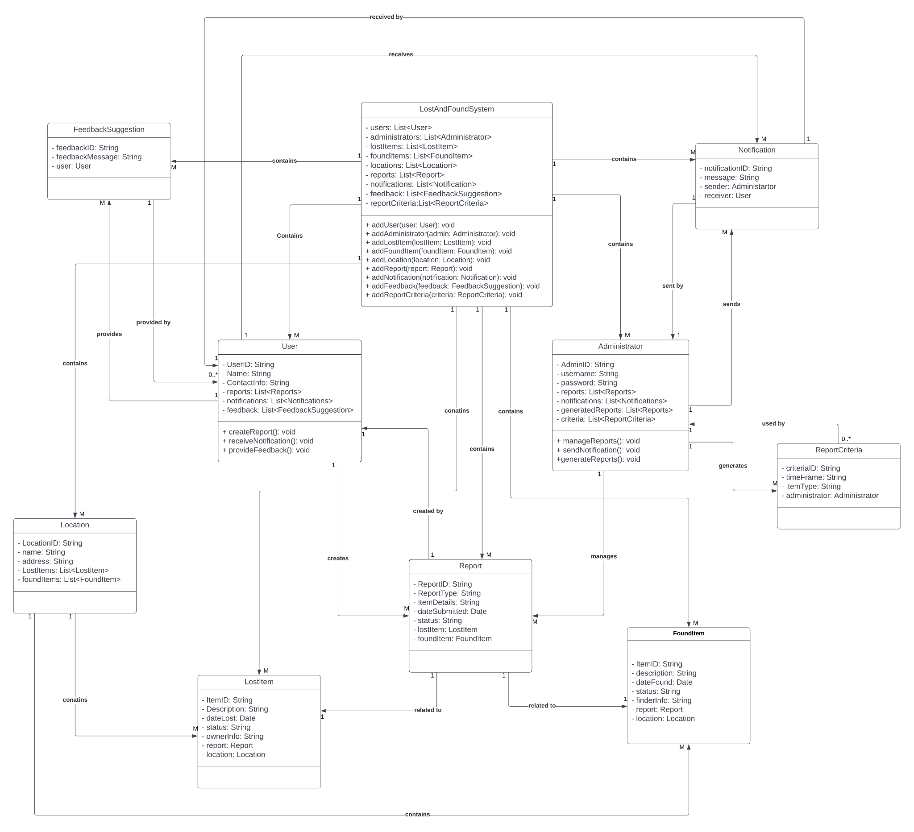
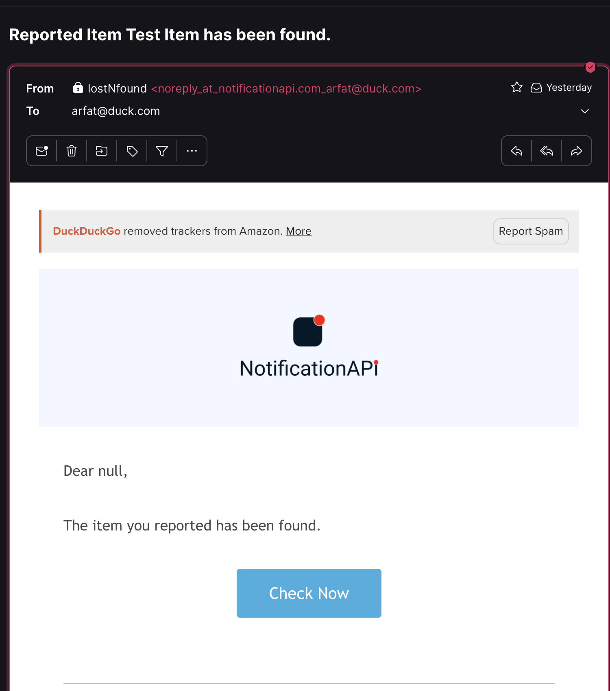

# LostNFound: Reporting & Retrieval System

## Introduction
LostNFound is a software solution designed to streamline the process of managing lost and found items. It's tailored for use in various organizational settings like educational institutions and workplaces, enhancing transparency and efficiency in item management.

## Tech Used
- **MongoDB**:for userData and Items.
- **Cloudinary**:for image storage.
- **app.notificationapi.com**: to send email/sms and push notifications.
- **JAVAFX and SceneBuiilder**: for front-end.
- **Java**: Main Appication Logic.

## Features
- **Efficient Reporting**: Simplify the process of reporting lost items.
- **Centralized Database**: Maintain a record of lost and found items.
- **User-Friendly Interface**: Accessible and easy to navigate for users and administrators.
- **Automated Notifications**: Keep users informed about their lost items.
- **Administrative Dashboard**: For managing lost and found inventory.

## Use Cases
- Reporting and searching for lost items.
- Claiming found items.
- Managing user accounts and item records.
- etc..

## System Architecture 

## UML Class Diagram

 

## Email Notifications

